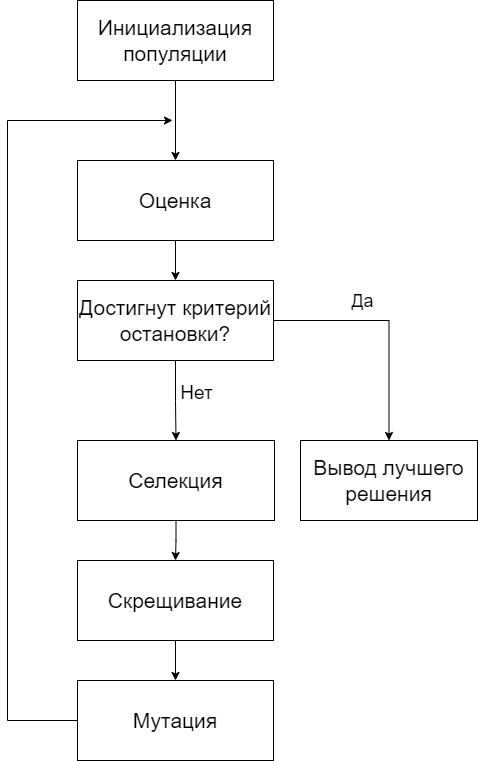
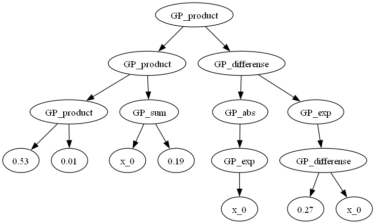
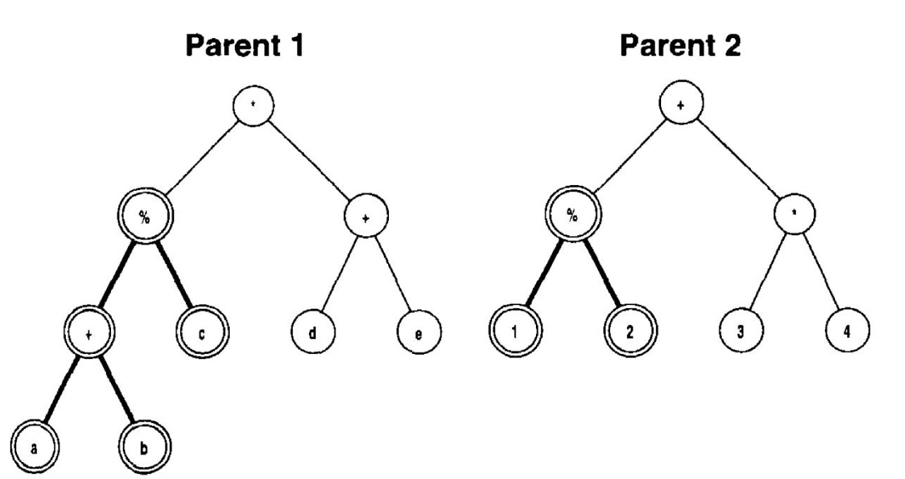
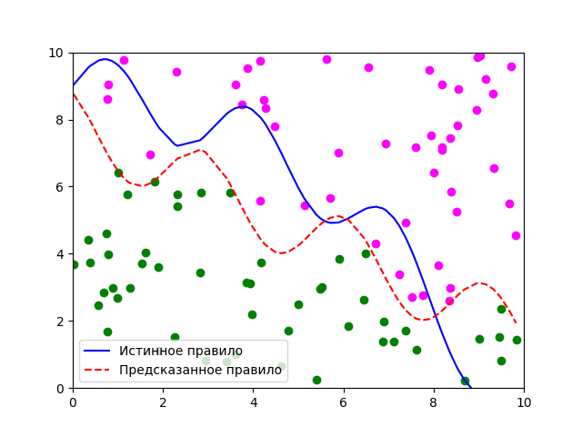
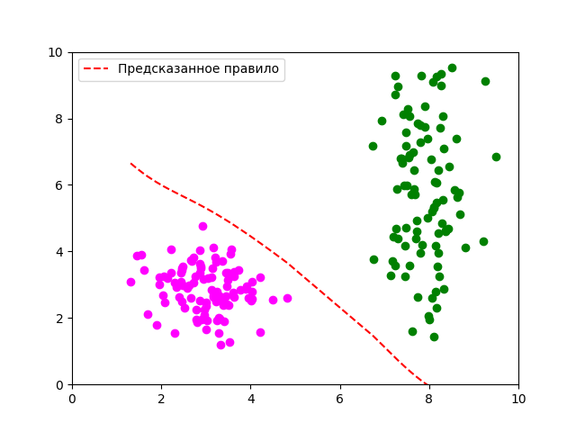
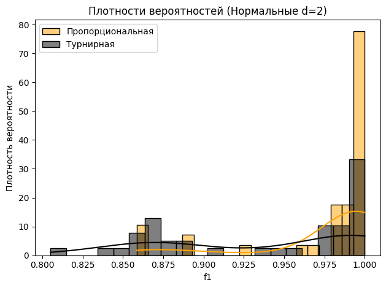

# Метод генетического программирования для задачи классификации

**Генетическое программирование** (ГП) — это метод машинного обучения, вдохновленный принципами естественного отбора и генетики. Он используется для автоматического создания компьютерных программ, которые решают задачи, заданные пользователем. ГП является разновидностью эволюционных алгоритмов и был разработан Джоном Козой в 1990-х годах.

# Основные этапы

Основные этапы генетического программирования включают:

1. **Инициализация**: Создание начальной популяции программ. Каждая программа представляет собой дерево, где узлы являются функциями (например, арифметические операции, логические операторы), а листья — терминалами (например, переменные, константы).

2. **Оценка**: Каждая программа в популяции оценивается по её способности решать задачу. Это делается с помощью функции приспособленности, которая измеряет, насколько хорошо программа выполняет заданную задачу.

3. **Селекция**: Выбор программ из текущей популяции для создания новой популяции. Программы с более высокой приспособленностью имеют больше шансов быть выбранными.

    - *Cкрещивание*: Обмен поддеревьями между двумя родительскими программами для создания потомков.
    - *Мутация*: Случайное изменение части программы (например, замена функции или терминала).
    - *Замена*: Формирование новой популяции из потомков и, возможно, некоторых родительских программ.

4. **Повторение**: Процесс оценки, селекции, применения генетических операторов и замены повторяется до тех пор, пока не будет найдено удовлетворительное решение или не будет достигнуто максимальное количество итераций.

Программы ГП представимы в виде деревьев. Например:

# О генетическом программировании

## О функциях и терминалах
В генетическом программировании терминальное и функциональное множества играют ключевую роль в построении программ. Они определяют базовые элементы, из которых строятся программы, и операции, которые могут быть выполнены над этими элементами.

Терминальное множество состоит из элементов, которые являются конечными узлами в дереве программы. Эти элементы не могут быть дальше разделены на более мелкие части. Терминалы могут включать:

- *Переменные*: Символы, представляющие входные данные или параметры. Например, в задаче регрессии это могут быть $x$, $y$, $z$ и т.д.
- *Константы*: Фиксированные значения, которые могут быть использованы в вычислениях. Например, числа $1$,$2$, $3.14$ и т.д.
- *Функции без аргументов*: Функции, которые не принимают аргументы и возвращают значение. Например, генераторы случайных чисел.

Функциональное множество состоит из операций или функций, которые принимают один или несколько аргументов и возвращают результат. Эти функции могут быть использованы для построения более сложных выражений и структур.

- *Арифметические операции*: $+,−,∗,/,sin,cos$ и т.д.
- *Специализированные функции*: Функции, специфичные для конкретной задачи или области. Например, в задачах обработки изображений это могут быть функции фильтрации или преобразования.

## О видах селекции
Селекция — это процесс выбора программ из текущей популяции для создания новой популяции. Существует несколько методов селекции, два из которых наиболее часто используются: турнирная селекция и пропорциональная селекция.

**Турнирная** селекция — это метод, при котором несколько программ случайным образом выбираются из популяции, и лучшая из них выбирается для размножения. Процесс выглядит следующим образом:

- *Выбор участников*: Случайным образом выбирается подмножество программ из текущей популяции. Размер этого подмножества называется размером турнира (обычно от 2 до 7).
- *Сравнение*: Сравниваются значения приспособленности выбранных программ.
- *Выбор победителя*: Программа с наилучшей приспособленностью из выбранного подмножества выбирается для размножения.

**Пропорциональная** селекция, также известная как рулетка или метод рулетки, выбирает программы с вероятностью, пропорциональной их приспособленности. Вероятность индивида быть выбранным для скрещивания определяется по формуле:

$$
p_i=\frac{f_i}{\sum \limits_{j} f_j}, i,j = \overline{1,n}
$$

где $n$ - размер популяции

## О скрещивании
Cкрещивание  —  генетический оператор, комбинирующий части двух родительских программ для создания потомков. Скрещивание играет ключевую роль в генерации новых решений и поддержании разнообразия в популяции. Существует несколько видов скрещивания, каждый из которых имеет свои особенности и применения. Но в данном случае использовалось только одноточечное/стандартное/tree-based скрещивание.

## О мутации
Мутации — генетические операторы, вносящие случайные изменения в структуру программ, чтобы поддерживать генетическое разнообразие популяции и предотвращать преждевременную конвергенцию к локальным оптимумам. Они играют важную роль в исследовании пространства решений и могут помочь найти более качественные решения.

В данной работе использовалась точечная мутация. В этой мутации случайным образом выбирается один узел в дереве и заменяется другим узлом (функцией или терминалом) из соответствующего множества.

## Об оценивании популяции
Для оценивания популяции (индивидов в ней) необходимо ввести функцию пригодности. При определённых условиях она совпадает с функцией потерь. Так в работе использовалась
функция потерь, построенная на основе *f1-score*. По завершении скрещивания могут получаться деверья произвольной длины. При это длинное дерево - не значит качественное. Для этого в функции пригодности необходимо предусмотреть штраф на длину дерева.

## Об инициализации популяции
Перед проведением генетических операций нужно вырастить деревья, которые собираются в них участвовать. Например, можно добавлять новые функциональные узлы в дерево до тех пор, пока глубина не достигнет определённого значения. Затем оставшиеся *листья* заполнить терминальными узлами. Такой метод взращивания дерева - **полный**.

Подводя итог краткому обзору метода генетического программирования представим необходимые параметры для его инициализации:
- функциональное и терминальное множества
- размер популяции (количество индивидов-программ)
- число поколений (новых популяций)
- вероятность мутации
- размер турнира
- ограничение по глубине дерева
- границы значений для констант

# Исследование влияния типа селекции на результативность

Проведено 40 независимых запусков на четырёх разных учебных задачах.
- Линейно разделимая, 2 класса, размерности d=2,5. Точки распределены
случайно равномерно в гиперкубе со стороной [0,10].
- Данные – гауссовы смеси, 2 класса, размерности d=2,5. Точки
распределены нормально в гиперкубе со стороной [0,10]

Распределение данных и решающее правило при равномерном распределении:

Полученное правило старается угадать характер настоящего, но при этом не сильно ошибается в классификации.

Распределение данных "два нормальных сгустка":

В данном случает алгоритм справился идеально и разделил оба класса.
Результаты исследований представлены в research.ipynb

В 3 из 4 тестах использование разных типов селекции не показало статистически значимых результатов. Только при решении задачи с двумя "нормальными сгустками" тест Манна-Уитни показал наличие статистически значимых различий.

Подводя итоги можно сказать, что при данных условиях использования алгоритма представленные типы селекции не приносят статистически значимых изменений в эффективности.

